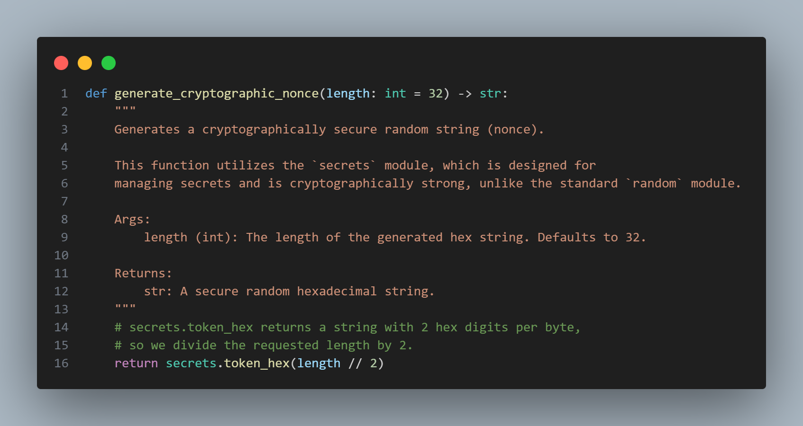
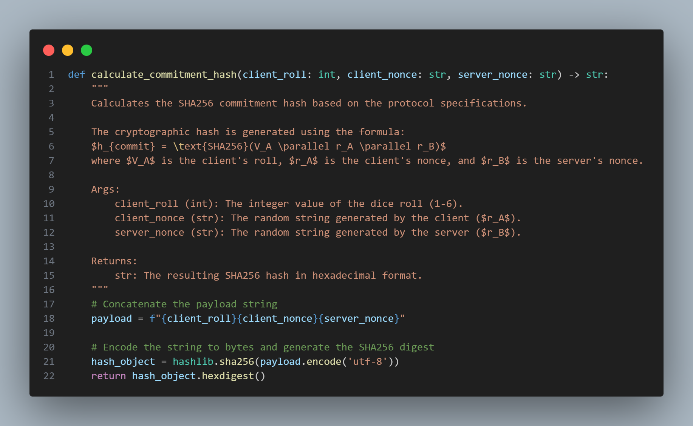
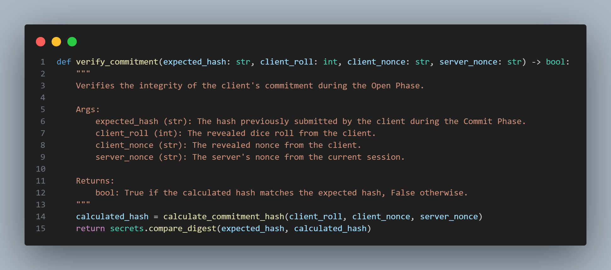
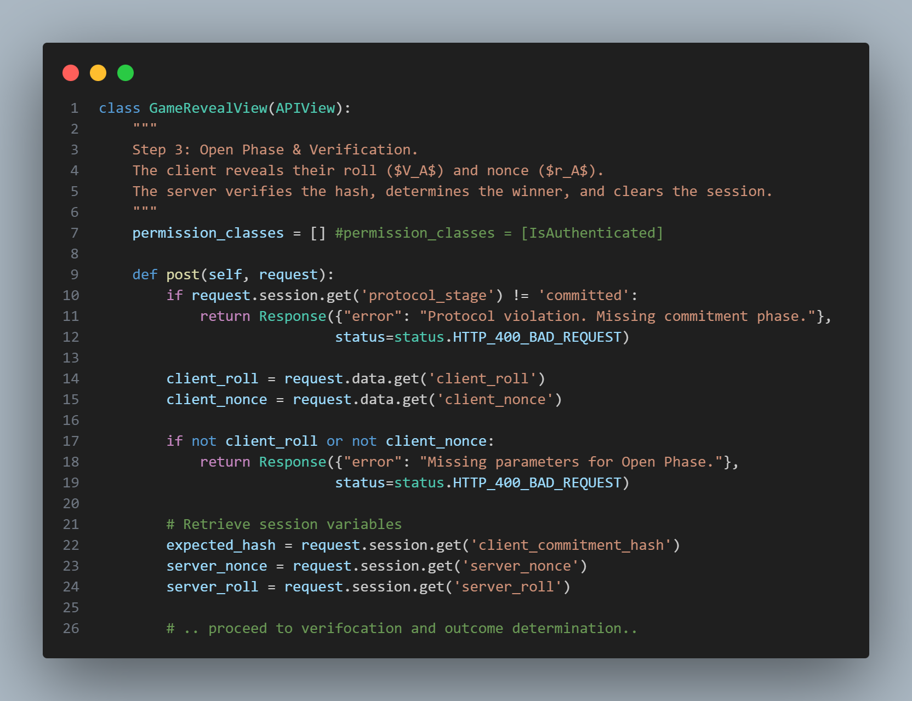
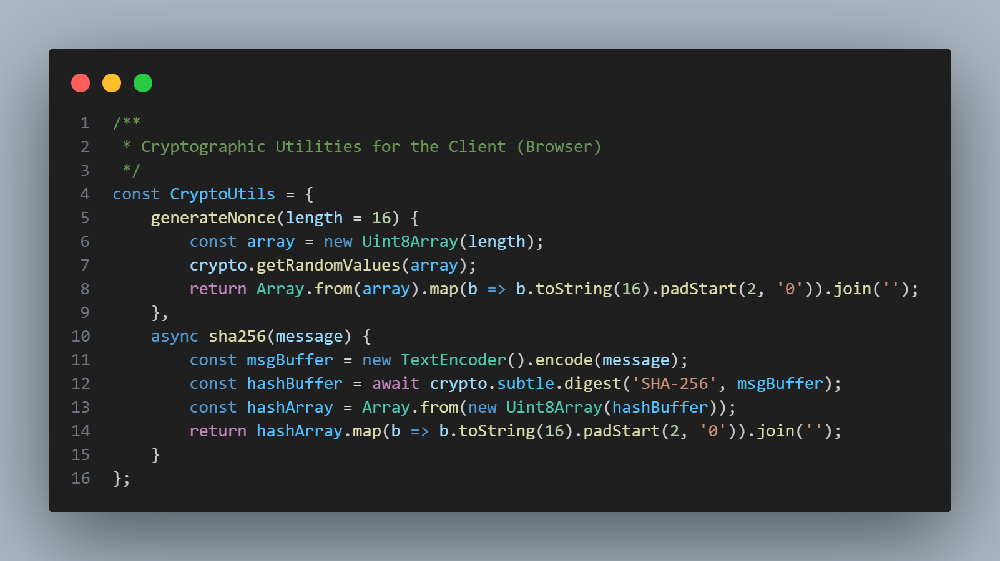

# Cryptographic Protocol & Game Logic Implementation

This document outlines the implementation details of the Hash-based Coin-Flipping Commitment Protocol (adapted for D6 dice) developed for the game_app module.

## 1. Cryptographic Engine (game_app/crypto.py)
This file acts as the core mathematical engine for the server.

**Secure Nonce Generation:** We implemented `generate_cryptographic_nonce()` using Python's built-in secrets module instead of the standard random module. The secrets module accesses the operating system's Cryptographically Secure Pseudo-Random Number Generator (CSPRNG), making the generation of the server's nonce ($r_B$) mathematically unpredictable.

**SHA256 Hashing:** The `calculate_commitment_hash()` function handles the payload concatenation ($V_A$ + $r_A$ + $r_B$) and hashes it using the industry-standard SHA256 algorithm via the hashlib library.

**Timing Attack Mitigation:** In the `verify_commitment()` function, we explicitly avoided using standard string equality (==) to compare the expected hash with the calculated hash. Instead, we used secrets.`compare_digest()`. This guarantees a constant-time comparison operation, completely neutralizing timing attacks where an adversary measures response times to guess the hash character by character.

## 2. API State Machine (game_app/views.py)
The API is designed as a strict, sequential State Machine to prevent protocol bypass attacks.

**Server-Side Sessions:** Trust is never delegated to the client. The server's secret roll ($V_B$), the server's nonce ($r_B$), and the current stage of the protocol are stored strictly in the Django backend session (request.session). The client cannot access or tamper with these variables.

**Strict Phase Enforcement:** The protocol enforces a linear progression: ***Init*** -> ***Commit*** -> ***Reveal***. If a client attempts to call the `/api/game/reveal/` endpoint without having successfully completed the `/api/game/commit/` phase, the server immediately rejects the request with a 400 Bad Request and flushes the session to prevent exploitation.

**Custom JWT Authentication Integration:** The initial authentication bypass has been completely removed. All cryptographic game endpoints (`/init`, `/commit`, `/reveal`) are now strictly secured utilizing a custom, in-house JWT validation mechanism (`get_user_from_token`). The server actively intercepts the HTTP request, decodes the `Authorization: Bearer` header, verifies the cryptographic signature of the payload (preventing token tampering), and ensures that only authenticated and authorized users can interact with the state machine.

## 3. Client-Side Cryptography (app.js)
The frontend was upgraded from a visual mock-up to a fully functional cryptographic client.

**Web Crypto API:** We implemented a CryptoUtils object that utilizes the browser's native, hardware-accelerated crypto.subtle API. This ensures that the client's nonce ($r_A$) and the local SHA256 hash calculation ($h_{commit}$) are performed securely on the client's machine before any data is transmitted over the network.

**Asynchronous Network Sync:** The game engine now uses async/await fetch requests to communicate with the Django backend. The UI updates (terminal logs, opponent dice reveal) are now strictly synchronized with the actual cryptographic responses from the server, eliminating the use of fake setTimeout delays.

## 4. Application Security & Production Hardening
Beyond the core cryptographic protocol, several enterprise-grade security measures were implemented to prepare the application for a production environment.

**Brute-Force & Credential Stuffing Protection:** To protect the authentication endpoints (`/api/login/`) from automated bot attacks, the `django-ratelimit` library was integrated. The system strictly monitors incoming requests and limits login attempts to 5 per minute per IP address. Exceeding this threshold immediately triggers a `403 Forbidden` response, effectively neutralizing brute-force password guessing.

**Security Headers (Clickjacking & XSS Mitigation):** Django's native security middleware was explicitly configured to instruct the client's browser to enable its built-in defenses.

- `X_FRAME_OPTIONS = 'DENY'` was applied to completely mitigate Clickjacking attacks by preventing the application from being embedded inside malicious iframes.

- `SECURE_BROWSER_XSS_FILTER = True` and `SECURE_CONTENT_TYPE_NOSNIFF = True` were enabled to block reflected Cross-Site Scripting (XSS) and prevent MIME-type sniffing vulnerabilities.

**Environment Hardening:** The application strictly enforces `DEBUG = False` for production deployment, ensuring that sensitive stack traces, environmental variables, and internal directory structures are never leaked to the end-user during a server error. Furthermore, `ALLOWED_HOSTS` are explicitly defined to prevent HTTP Host Header spoofing.

## 5. Summary of Security Achievements
By implementing the above architecture, we successfully achieved:

* **Zero-Knowledge Proof Concept:** Neither party can know the other's roll before committing to their own.

* **Immutability:** Once the hash is sent, the client cannot change their roll ($V_A$) or nonce ($r_A$) without breaking the final verification.

* **Protection against predictability:** Using CSPRNG for all nonces.

* **Protection against Side-Channel Attacks:** Using constant-time hash verification.

* **Secure Authentication:** Implementation of a robust JWT architecture without relying on insecure session cookies.

* **Brute-Force Immunity:** IP-based rate limiting actively dropping malicious authentication floods.

* **Production Readiness:** Hardened configuration with strict security headers and disabled debug environments to prevent information disclosure.

